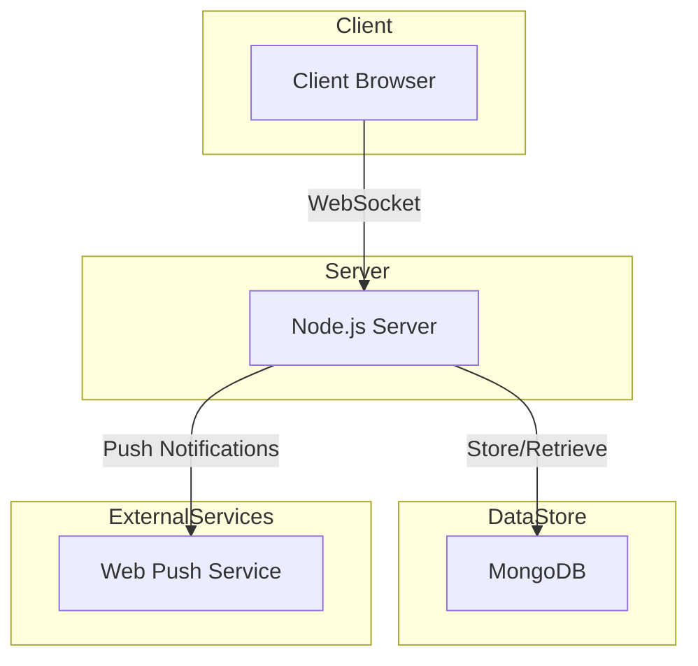

# Chat Application Architecture

## Overview

## Components

### 1. Client (Browser)
- HTML/CSS/JavaScript interface
- Socket.IO client for real-time communication
- Service Worker for offline support
- PWA manifest for installation

### 2. Server (Node.js)
- Express.js for HTTP server
- Socket.IO for WebSocket communication
- MongoDB client for data persistence
- Automatic message cleanup

### 3. Database (MongoDB)
- Messages collection with TTL index (24 hours)
- Users collection for user tracking
- Indexes for performance optimization

## Data Flow

1. **User Connection**:
   - Client connects to server via WebSocket
   - Server registers user and sends existing messages
   - Online user list is updated and broadcasted

2. **Message Sending**:
   - Client sends message via WebSocket
   - Server stores message in MongoDB
   - Server broadcasts message to all connected clients

3. **Message Receiving**:
   - Server pushes message to all clients
   - Clients display message in UI
   - Messages persist in database

4. **Typing Indicators**:
   - Client sends typing status via WebSocket
   - Server broadcasts typing status to other clients
   - Clients display typing indicators

5. **Offline Support**:
   - Service Worker caches assets
   - Messages queued when offline
   - Automatic reconnection and message sync

6. **Message Expiration**:
   - MongoDB TTL index automatically removes old messages
   - Server performs periodic cleanup
   - Clients receive updated message list

## Security Considerations

1. **CORS**: Configured for localhost development
2. **Data Validation**: Server-side validation of messages
3. **Rate Limiting**: Not implemented but recommended for production
4. **Input Sanitization**: Messages sanitized before storage

## Scalability

1. **Horizontal Scaling**: Multiple server instances with load balancer
2. **Database Sharding**: MongoDB sharding for large datasets
3. **Message Queuing**: Redis for message queuing in distributed systems
4. **CDN**: Static assets served via CDN

## Future Enhancements

1. **Authentication**: User login and registration
2. **Encryption**: End-to-end message encryption
3. **File Sharing**: Image and file upload support
4. **Chat Rooms**: Multiple conversation channels
5. **Push Notifications**: Web Push API integration
6. **Message Search**: Full-text search capability